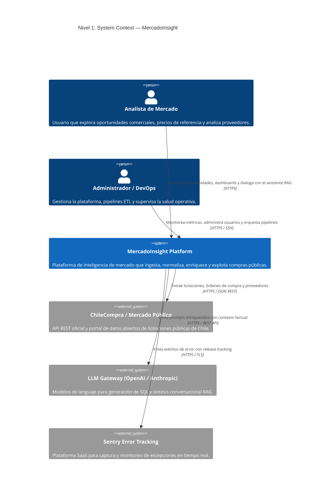

# Arquitectura del Sistema — MercadoInsight

Este documento formaliza la arquitectura técnica de **MercadoInsight** adoptando el **Modelo C4** (Contexto, Contenedores, Componentes y Código), detallando los diagramas de arquitectura, contratos de datos, dependencias y relaciones con sistemas externos.

---

## 1. Modelo C4 — Nivel 1: System Context (Contexto del Sistema)

El diagrama de contexto muestra a los usuarios del sistema y cómo MercadoInsight se integra con fuentes externas de datos y servicios satélite:



---

## 2. Modelo C4 — Nivel 2: Containers (Contenedores)

El diagrama de contenedores desglosa la aplicación en aplicaciones ejecutables, almacenes de datos y componentes de red:

```mermaid
C4Container
    title Nivel 2: Containers — Topología de MercadoInsight

    Person(user, "Usuario Analista", "Navegador web")

    Container(nginx, "Reverse Proxy (NGINX)", "NGINX 1.27 Alpine", "Terminación TLS, Rate Limiting, compresión gzip/brotli y enrutamiento.")
    Container(frontend, "Frontend SPA", "React 18, TypeScript, Vite", "Interfaz gráfica interactiva, explorador de licitaciones y chat RAG.")
    Container(backend, "Backend API", "FastAPI, Python 3.14, Uvicorn", "Lógica de negocio, autenticación JWT, orquestación RAG y endpoints REST.")
    Container(worker, "NLP & ETL Worker", "Celery, Python 3.14", "Procesamiento asíncrono, enriquecimiento taxonómico y cálculo de embeddings.")

    ContainerDb(postgres, "Base de Datos", "PostgreSQL 17 + pgvector", "Almacenamiento relacional (core, dw, marts) y vectorial (knowledge).")
    ContainerDb(redis, "Broker & Caché", "Redis 7 Alpine", "Broker de mensajes para Celery y almacenamiento en caché de respuestas rápidas.")
    ContainerDb(minio, "Almacenamiento de Objetos", "MinIO (S3 Compatible)", "Almacén de documentos adjuntos, anexos y respaldos inmutables.")

    Container_Boundary(obs_boundary, "Observabilidad")
        Container(prometheus, "Métricas", "Prometheus", "Almacén de series temporales y evaluación de reglas de alerta.")
        Container(grafana, "Visualización", "Grafana", "Dashboards interactivos para SLOs, BD, ETL y costos de IA.")
        Container(loki, "Agregador de Logs", "Grafana Loki", "Indexación y almacenamiento de logs estructurados JSON.")
    Container_Boundary_End()

    Rel(user, nginx, "Peticiones HTTP/HTTPS", "Port 80/443")
    Rel(nginx, frontend, "Sirve archivos estáticos", "HTTP")
    Rel(nginx, backend, "Reenvía peticiones de API /api/*", "HTTP")

    Rel(backend, postgres, "Lectura y escritura relacional y vectorial", "AsyncPG / Port 5432")
    Rel(backend, redis, "Encola tareas y gestiona sesiones", "Port 6379")
    Rel(backend, minio, "Sube y genera URLs firmadas de anexos", "Port 9000")

    Rel(worker, redis, "Consume tareas pendientes de colas", "Port 6379")
    Rel(worker, postgres, "Persiste embeddings y clasificaciones", "Port 5432")

    Rel(prometheus, backend, "Scrape de métricas /metrics", "HTTP")
    Rel(grafana, prometheus, "Consulta métricas para paneles", "HTTP")
    Rel(backend, loki, "Envía logs estructurados vía Promtail", "HTTP")
```

---

## 3. Modelo C4 — Nivel 3: Components (Componentes de FastAPI Backend)

Desglose de los módulos internos del contenedor `apps/backend/app/`:

```mermaid
C4Component
    title Nivel 3: Components — FastAPI Backend

    Container_Boundary(api_boundary, "FastAPI Application")
        Component(router_auth, "Auth Router", "FastAPI APIRouter", "Gestión de sesiones, login, refresh y tokens JWT Bearer.")
        Component(router_chat, "Chat & RAG Router", "FastAPI APIRouter", "Gestión de sesiones conversacionales y streaming SSE.")
        Component(router_nlp, "NLP Router", "FastAPI APIRouter", "Endpoints de clasificación sincrónica y búsqueda híbrida.")
        Component(router_etl, "ETL Router", "FastAPI APIRouter", "Disparo manual y consulta de estado de pipelines.")
        Component(router_analytics, "Analytics Router", "FastAPI APIRouter", "Resúmenes ejecutivos, series de tiempo y rankings.")

        Component(service_rag, "RAG Orchestrator", "Python Service", "Coordina intención, Text-to-SQL, búsqueda vectorial y prompt building.")
        Component(service_hybrid, "Hybrid Search Engine", "Python Service", "Calcula ranking RRF combinando FTS y pgvector.")
        Component(service_etl, "ETL Pipeline Orchestrator", "Python Service", "Ejecuta etapas de extracción, validación, cuarentena y carga.")

        Component(guardrails, "AI Guardrails & Cost", "Python Component", "Valida que el SQL sea SELECT de solo lectura y rastrea tokens/USD.")
        Component(telemetry, "Telemetry & Sentry", "FastAPI Middleware", "Inyecta request_id, registra métricas Prometheus y trazas.")

        Component(repo_db, "SQLAlchemy Repositories", "Repository Pattern", "Acceso tipado a esquemas core, dw y marts.")
        Component(repo_vector, "Vector Repository", "pgvector Driver", "Consultas de similitud de coseno sobre knowledge.embeddings.")
    Container_Boundary_End()

    Rel(router_chat, service_rag, "Invoca pipeline RAG")
    Rel(router_nlp, service_hybrid, "Ejecuta búsqueda híbrida")
    Rel(router_etl, service_etl, "Inicia o consulta pipelines")

    Rel(service_rag, guardrails, "Verifica consulta SQL y presupuesto de tokens")
    Rel(service_rag, repo_db, "Ejecuta consultas relacionales")
    Rel(service_rag, repo_vector, "Recupera fragmentos relevantes")
    Rel(service_hybrid, repo_vector, "Búsqueda vectorial")
    Rel(service_hybrid, repo_db, "Búsqueda Full-Text")
```

---

## 4. Dependencias e Integraciones Externas

| Integración | Protocolo | Autenticación | Resiliencia y Fallbacks |
| :--- | :--- | :--- | :--- |
| **API ChileCompra** | HTTPS / REST | API Key en cabecera / query | Reintentos exponenciales con Tenacity; si la API está degradada, se conmuta al dataset histórico en datos abiertos. |
| **OpenAI Gateway** | HTTPS / REST | Bearer API Key | Fallback a mock determinístico en entornos locales/CI; circuit breaker ante cuotas excedidas. |
| **Sentry** | HTTPS / TLS | DSN Project Key | Despacho asíncrono sin bloqueo de peticiones HTTP de usuario. |
| **GitHub Container Registry** | OCI Artifacts | Token de GitHub Actions | Imágenes Docker inmutables firmadas por tag semántico y commit SHA. |

---

## 5. Versionado de Diagramas y Arquitectura

- Todos los diagramas de este documento utilizan sintaxis oficial **Mermaid** y están versionados junto con el código fuente en Git.
- Ante cualquier cambio arquitectónico o adición de componentes, este archivo y [docs/architecture/overview.md](docs/architecture/overview.md) deben actualizarse en la misma revisión.
