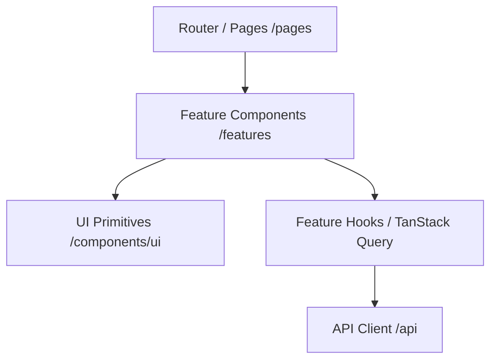

# Arquitectura Frontend - Market Insight ChileCompra

Este documento define la arquitectura, convenciones de diseño y estructura de código para el dashboard web de **Market Insight ChileCompra**, implementado en `apps/frontend`.

---

## 1. Visión General & Stack Tecnológico

El frontend está construido como una Single Page Application (SPA) moderna, enfocada en alta velocidad de respuesta, estética enterprise y una rigurosa separación de responsabilidades para el análisis de compras públicas.

* **Core**: React 18+ con TypeScript en modo estricto.
* **Build Tool**: Vite con soporte de HMR ultrarrápido y resolución de alias de rutas.
* **Estado de Servidor**: TanStack Query (React Query) para caché, revalidación y sincronización de datos de la API.
* **Estado de Cliente**: Zustand para estado global de interfaz liviano (tema, sidebar, sesión activa).
* **Validación**: Zod para tipado y validación de esquemas de datos y formularios.
* **Componentes & Diseño**: Arquitectura de componentes desacoplada (shadcn/ui compatible) con diseño visual premium adaptado a licitaciones públicas.

---

## 2. Estructura de Directorios Modular

Todo el código fuente reside bajo `apps/frontend/src/` organizado en dominios funcionales y capas de abstracción claras:

```text
apps/frontend/src/
├── app/                      # Bootstrap de aplicación y proveedores globales
│   └── index.ts              # Exportación de Providers (QueryClient, Theme, Router)
├── assets/                   # Recursos estáticos
│   ├── icons/                # Iconografía SVG optimizada
│   └── images/               # Logotipos e ilustraciones corporativas
├── components/               # Componentes genéricos compartidos
│   ├── ui/                   # Primitivas de diseño atómicas (Button, Card, Badge, Modal)
│   ├── layout/               # Shell de la aplicación (Header, Sidebar, Breadcrumbs)
│   ├── feedback/             # Estados de carga (Skeleton), estados de error y vacío
│   └── index.ts              # Barrel export de componentes compartidos
├── features/                 # Módulos por dominio de negocio (Domain-Driven)
│   ├── auth/                 # Autenticación, JWT, perfil y control de acceso
│   ├── dashboard/            # Resumen ejecutivo, widgets y KPIs principales
│   ├── licitaciones/         # Catálogo, explorador, tracking y filtros de licitaciones
│   ├── proveedores/          # Directorio de proveedores, perfiles y análisis competitivo
│   ├── organismos/           # Organismos compradores, historial y plazos de pago
│   ├── categorias/           # Explorador de taxonomía UNSPSC y rubros prioritarios
│   ├── adjudicaciones/       # Análisis histórico de adjudicaciones y precios de referencia
│   ├── analytics/            # Tendencias, estacionalidad, forecast y reportes
│   ├── search/               # Búsqueda semántica híbrida (pgvector) y facetas
│   └── ai/                   # Copiloto de licitaciones, resúmenes y chat interactivo
├── hooks/                    # Custom hooks globales reutilizables
├── lib/                      # Utilidades, formateadores y constantes del sistema
│   ├── utils.ts              # Helpers de manipulación de clases (cn), debounce, sleep
│   ├── formatters.ts         # Formateadores chilenos (CLP, UF, RUT, fechas es-CL)
│   ├── constants.ts          # Configuración de app, claves de caché QUERY_KEYS
│   └── index.ts              # Barrel export de utilidades
├── pages/                    # Vistas conectadas al router (Thin page entrypoints)
│   ├── DashboardPage.tsx     # Vista del Dashboard
│   ├── LoginPage.tsx         # Vista de Inicio de Sesión
│   └── index.ts              # Barrel export de páginas
├── schemas/                  # Esquemas de validación Zod
├── stores/                   # Stores de estado cliente con Zustand
├── types/                    # Tipos e interfaces globales de TypeScript
│   ├── common.ts             # Paginación, ordenamiento, respuestas y errores API
│   └── index.ts              # Barrel export de tipos
└── vite-env.d.ts             # Tipos de entorno de Vite
```

---

## 3. Separación de Responsabilidades (3-Tier Architecture)

Para asegurar escalabilidad y mantenibilidad a largo plazo, el código se distribuye en tres niveles estrictos:



### Capa 1: Primitivas de UI (`components/ui/`)
* **Propósito**: Componentes visuales puros y desacoplados (botones, tablas, diálogos, selectores, tooltips).
* **Regla**: **Cero conocimiento del dominio de negocio** y **cero llamadas a APIs**.
* **Entrada/Salida**: Solo se comunican mediante props tipadas y eventos estándar.

### Capa 2: Módulos de Dominio (`features/*`)
* **Propósito**: Cada carpeta en `features/` encapsula un dominio de negocio específico.
* **Estructura Interna Recomendada de un Feature**:
  ```text
  features/licitaciones/
  ├── components/          # Componentes específicos del negocio (LicitacionCard, TenderFilters)
  ├── hooks/               # Queries y mutaciones (useLicitacionesQuery, useWatchTender)
  ├── types.ts             # Tipos de dominio específicos de licitaciones
  ├── schemas.ts           # Validadores Zod de filtros y formularios del feature
  └── index.ts             # API pública exportada por el feature
  ```
* **Regla**: Ningún feature debe acceder a componentes internos no exportados de otro feature.

### Capa 3: Páginas de Rutas (`pages/*`)
* **Propósito**: Vistas de nivel superior asociadas a una ruta URL.
* **Regla**: Las páginas son delgadas ("thin wrappers"). Su responsabilidad es:
  1. Extraer parámetros de ruta y search params de la URL.
  2. Componer los componentes de layout (`Header`, `Sidebar`) con los componentes del `feature`.
  3. No contener lógica pesada de cálculo ni manipulación directa de APIs.

---

## 4. Estrategia de Path Aliases (`@/*`)

Se utiliza el alias `@/*` mapeado a `src/*` en:
1. `tsconfig.json`:
   ```json
   {
     "compilerOptions": {
       "baseUrl": ".",
       "paths": {
         "@/*": ["src/*"]
       }
     }
   }
   ```
2. `vite.config.ts`:
   ```typescript
   import path from 'path';
   
   resolve: {
     alias: {
       '@': path.resolve(__dirname, './src'),
     },
   }
   ```

### Buenas Prácticas de Importación
* Preferir siempre rutas absolutas mediante el alias `@/`:
  ```typescript
  // Recomendado
  import { formatCLP, formatRUT } from '@/lib';
  import { KpiCard } from '@/components/KpiCard';
  import type { PaginatedResponse } from '@/types';

  // Evitar rutas relativas complejas
  import { formatCLP } from '../../../lib/formatters';
  ```

---

## 5. Convenciones de Nomenclatura y Estilo

* **Componentes React**: PascalCase en nombres de archivo y exportación (`TenderDetailCard.tsx`, `KpiCard.tsx`).
* **Custom Hooks**: camelCase prefijado con `use` (`useLicitaciones.ts`, `useMediaQuery.ts`).
* **Utilidades y Constantes**: camelCase para funciones (`formatCLP`, `validateRUT`); UPPER_SNAKE_CASE para constantes de configuración (`APP_CONFIG`, `QUERY_KEYS`).
* **Tipos e Interfaces**: PascalCase (`PaginationParams`, `TenderItem`).
* **Archivos Barrel**: `index.ts` en cada nivel para centralizar exportaciones y desacoplar rutas internas.

---

## 6. Formateo y Reglas de Negocio Locales (Chile)

El módulo `src/lib/formatters.ts` estandariza el manejo de información financiera y fiscal chilena:

| Tipo de Dato | Formato / Ejemplo | Función |
| :--- | :--- | :--- |
| **Moneda CLP** | `$15.450.000` (sin decimales) | `formatCLP(amount)` |
| **Unidad de Fomento (UF)** | `1.250,75 UF` (2 decimales con coma) | `formatUF(amount)` |
| **Compacto (KPIs)** | `$15,4M` / `$1,2B` / `$450K` | `formatCompactCurrency(amount)` |
| **RUT Empresa/Persona** | `12.345.678-K` (con puntos y guión) | `formatRUT(rut)` |
| **Validación de RUT** | Algoritmo Módulo 11 | `validateRUT(rut)` |
| **Fechas estándar** | `DD/MM/YYYY` (es-CL) | `formatDate(date)` |
| **Fechas con hora** | `DD/MM/YYYY HH:mm` (es-CL) | `formatDateTime(date)` |
| **Tiempo Relativo** | `hace 2 horas`, `hace 3 días` | `formatRelativeTime(date)` |

---

## 7. Gestión del Estado de Servidor (TanStack Query)

Las consultas a la API se organizan mediante claves estructuradas en `QUERY_KEYS` (`src/lib/constants.ts`):

```typescript
export const QUERY_KEYS = {
  licitaciones: {
    all: ['licitaciones'] as const,
    list: (params: Record<string, unknown>) => ['licitaciones', 'list', params] as const,
    detail: (id: string | number) => ['licitaciones', 'detail', id] as const,
  },
  // ...
};
```

Esto previene colisiones en la caché y facilita invalidaciones atómicas al mutar estados (por ejemplo, al guardar una licitación en seguimiento).
