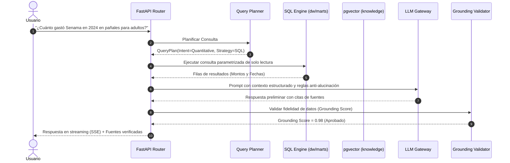

# Arquitectura de IA — NLP & Conversational RAG

Este documento describe la arquitectura de inteligencia artificial de **MercadoInsight**, integrando la capa de Procesamiento de Lenguaje Natural (NLP, Fase 7) y el Asistente Conversacional RAG (Fase 9).

---

## 1. Visión y Principio Rector

> **MercadoInsight AI no es un chatbot genérico conectado a una base de datos, sino un motor de inteligencia de compras públicas que responde exclusivamente a partir de evidencia recuperable, verificable y con trazabilidad de costos.**

La arquitectura combina dos subsistemas complementarios:
1. **Pipeline de Enriquecimiento NLP (Batch/Worker)**: Transforma texto no estructurado de licitaciones en conocimiento taxonómico y vectores densos.
2. **Motor Conversacional RAG (En Tiempo Real)**: Responde preguntas complejas de negocio mediante planificación determinística, Text-to-SQL, búsqueda híbrida y validación estricta de grounding.

---

## 2. Pipeline de NLP y Enriquecimiento

Operado de forma asíncrona por el `nlp-worker` (Celery) sobre cada nueva licitación ingestada:

```text
Texto de Licitación (Título, Descripción, Ítems)
       │
       ▼
Preprocesamiento de Texto (Limpieza, Tokenización, Lemmatización)
       │
       ├─────────────────────────────────────────┐
       ▼                                         ▼
Clasificador de Reglas                   Embeddings Densos
(Taxonomía de 3 niveles:             (Sentence Transformers
Geriatría / Discapacidad)              all-MiniLM-L6-v2)
       │                                         │
       ├───────────────────┬─────────────────────┤
       ▼                   ▼                     ▼
Extracción NER     Extracción Productos    Decisión Híbrida
(Montos, Unidades,   (Especificaciones     (Score de Relevancia
Organismos)            Técnicas)            y Confianza [0,1])
       │                   │                     │
       └───────────────────┼─────────────────────┘
                           ▼
              Persistencia en Schema `knowledge`
          (Si Confianza < 0.7 ──> Cola Human-in-the-Loop)
```

---

## 3. Motor Conversacional RAG

Para responder consultas de usuarios en `/api/v1/chat`:



---

## 4. Búsqueda Híbrida: RRF (Reciprocal Rank Fusion)

Cuando las consultas son temáticas con filtros (por ejemplo: *"licitaciones de sillas de ruedas eléctricas en la Región del Biobío"*), el sistema combina:
- **Puntuación BM25 / Full-Text Search**: Coincidencia léxica exacta sobre términos técnicos en español.
- **Similitud Coseno Vectorial**: Coincidencia semántica con `pgvector` sobre representaciones densas.
- **Fórmula RRF**:
  $$\text{Score}(d) = \sum_{m \in \{\text{FTS}, \text{Vector}\}} \frac{1}{k + \text{rank}_m(d)} \quad (k=60)$$

---

## 5. Gobernanza de Modelos y Costos

- **MLOps**: Registro de experimentos, control de versiones de modelos y detección continua de Data Drift mediante divergencia Kullback-Leibler.
- **Cost Tracker**: Medición por solicitud de tokens de entrada/salida y costo estimado en USD, alertando en Prometheus ante consumos anómalos.
- **Guardrails de Seguridad**:
  - Rol de base de datos `ai_analyst` con permiso exclusivo `pg_read_all_data`.
  - Bloqueo en tiempo de ejecución de palabras clave destructivas (`DROP`, `DELETE`, `ALTER`, `TRUNCATE`, `INSERT`, `UPDATE`).
