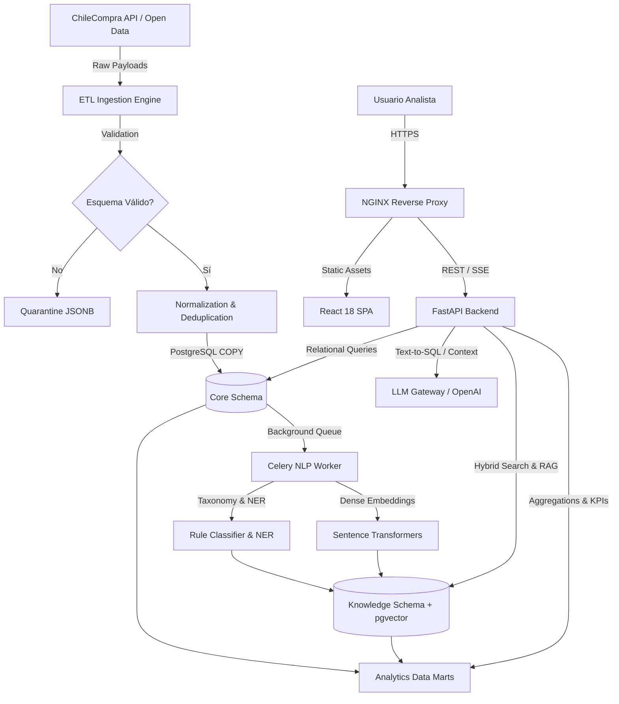

# Arquitectura del Sistema — MercadoInsight

Este documento detalla la arquitectura global de **MercadoInsight**, una plataforma de inteligencia de mercado basada en datos de contratación pública de ChileCompra/Mercado Público, orientada al análisis de oportunidades, proveedores, organismos, categorías, precios y tendencias, incorporando búsqueda semántica e IA conversacional.

---

## 1. Principios de Diseño

El sistema está diseñado bajo los principios de **Clean Architecture**, **SOLID**, **Domain-Driven Design (DDD) ligero**, **Repository Pattern** e **Inyección de Dependencias**:

1. **Independencia de Frameworks**: La lógica de negocio del dominio no depende de FastAPI, SQLAlchemy ni librerías de presentación.
2. **Testabilidad**: Todas las reglas de negocio, modelos de clasificación, pipelines de scoring y procesadores de ETL se pueden probar sin bases de datos vivas ni servicios externos.
3. **Independencia de la UI**: La API REST y los servicios asíncronos operan de manera desacoplada del frontend web (React SPA).
4. **Independencia de la Base de Datos**: Los contratos de repositorios aíslan el almacenamiento relacional (`PostgreSQL 17`), vectorial (`pgvector`) y de objetos (`MinIO`).
5. **Aislamiento en Dos Niveles de Red**: Estricta separación entre red pública (`public-net`) y red privada (`private-net`), garantizando que ningún motor de datos o almacenamiento quede expuesto a Internet.

---

## 2. Capas de la Aplicación

```text
┌─────────────────────────────────────────────────────────┐
│                   Presentation Layer                    │
│      React 18 SPA (Vite/Tailwind)  |  FastAPI Endpoints │
└───────────────────────────┬─────────────────────────────┘
                            │
┌───────────────────────────▼─────────────────────────────┐
│                    Application Layer                    │
│   Use Cases | Services | Orchestrators | Celery Workers │
└───────────────────────────┬─────────────────────────────┘
                            │
┌───────────────────────────▼─────────────────────────────┐
│                      Domain Layer                       │
│    Entities | Value Objects | Domain Events | Interfaces│
└───────────────────────────┬─────────────────────────────┘
                            │
┌───────────────────────────▼─────────────────────────────┐
│                  Infrastructure Layer                   │
│   SQLAlchemy 2 Repositories | ChileCompra SDK | Redis   │
│   MinIO Object Storage | pgvector | Prometheus Telemetry │
└─────────────────────────────────────────────────────────┘
```

### 2.1 Presentación (Presentation Layer)
- **Frontend SPA**: Desarrollado en React 18 con TypeScript, Tailwind CSS, TanStack Query y componentes de visualización interactiva.
- **FastAPI**: Enrutadores REST versionados (`/api/v1/*`), serialización canónica con Pydantic v2, autenticación JWT Bearer y endpoints de streaming Server-Sent Events (SSE) para la IA conversacional.

### 2.2 Aplicación (Application Layer)
- **Servicios de Aplicación**: Coordinación de casos de uso (análisis de adjudicaciones, búsqueda híbrida, gestión de usuarios, generación de reportes).
- **Orquestación ETL**: Pipeline desacoplado para ingesta incremental, validación de esquemas y cuarentena de anomalías.
- **Celery Workers**: Ejecución en background de tareas pesadas (clasificación NLP, embeddings densos, sincronizaciones de ChileCompra).

### 2.3 Dominio (Domain Layer)
- **Entidades**: Licitación, Ítem, Oferta, Adjudicación, Proveedor, Organismo, Conversación de IA.
- **Reglas de Negocio**: Scoring de riesgo/oportunidad, asignación de relevancia comercial para el nicho geriátrico y de discapacidad.
- **Contratos de Repositorios**: Interfaces abstractas (`ABC`) que definen las operaciones requeridas sobre los datos.

### 2.4 Infraestructura (Infrastructure Layer)
- **Persistencia Relacional y Vectorial**: PostgreSQL 17 con extensión `pgvector` e índices HNSW para búsqueda por similitud de coseno.
- **Almacenamiento de Objetos**: MinIO para anexos de licitaciones, documentos raw y respaldos.
- **Cache y Colas**: Redis 7 como broker de mensajes para Celery y capa de almacenamiento en caché con invalidación selectiva.
- **Observabilidad**: Exportadores Prometheus, logging estructurado JSON para Loki, Sentry para errores y OpenTelemetry para trazas.

---

## 3. Flujo Integral de Datos



---

## 4. Estructura de Documentación Relacionada

- [Backend Architecture](backend.md): Detalles de FastAPI, Celery y servicios internos.
- [Frontend Architecture](frontend.md): Arquitectura de la SPA en React y consumo de datos.
- [Database Architecture](database.md): Diseño de esquemas PostgreSQL, migraciones y pgvector.
- [AI & Knowledge Architecture](ai.md): Pipelines de procesamiento de lenguaje natural y RAG.
- [Infrastructure Architecture](infrastructure.md): Configuración de contenedores, redes y NGINX.
- [C4 Model Diagrams](overview.md#modelo-c4): Modelos formales de contexto, contenedores y componentes.
