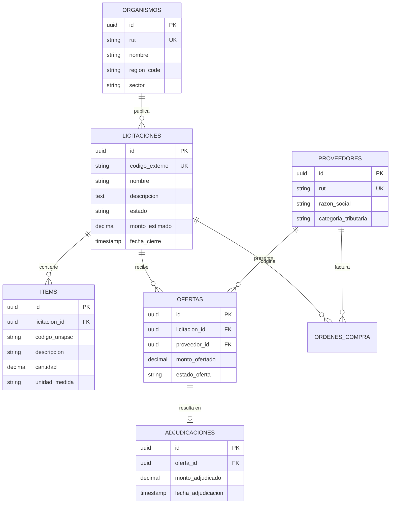

# Modelo de Datos — Data Warehouse & Relacional

Este documento detalla el modelo de datos operacional y analítico de **MercadoInsight**, organizado en esquemas de PostgreSQL y diseñado para permitir consultas analíticas de alto rendimiento sobre compras públicas.

---

## 1. Esquema Canónico (`core`)

El esquema `core` almacena las entidades normalizadas provenientes de ChileCompra:

---

## 2. Esquema Semántico (`knowledge`)

Almacena el conocimiento inferido por los modelos de lenguaje y procesamiento de texto:

- **`knowledge.taxonomies`**: Taxonomía jerárquica de 3 niveles (`Category` -> `Subcategory` -> `Concept`), especializada en geriatría, discapacidad y ayudas técnicas.
- **`knowledge.rule_classifications`**: Salida de reglas deterministas de clasificación con confianza y matches léxicos.
- **`knowledge.embeddings`**: Vectores densos generados por `sentence-transformers` indexados con HNSW (`vector(384)`).
- **`knowledge.ner_entities`**: Entidades nombradas estructuradas extraídas de las bases y especificaciones técnicas (montos, marcas, modelos, plazos).
- **`knowledge.ai_conversations`** y **`knowledge.ai_messages`**: Historial de interacciones RAG de usuarios, prompts, tokens consumidos, fuentes y feedback.

---

## 3. Esquema Dimensional (`dw` & `marts`)

Diseñado bajo metodología Kimball con tablas de hechos y dimensiones para agregaciones analíticas:

### 3.1 Dimensiones
- `dim_tiempo`: Granularidad diaria con atributos de año, mes, trimestre, día de semana y festivos.
- `dim_organismo`: Jerarquía institucional (Ministerio -> Servicio -> Dependencia regional).
- `dim_proveedor`: Tamaño de empresa, antigüedad y récord de participación.
- `dim_rubro`: Segmentos UNSPSC e industrias.

### 3.2 Hechos y Vistas de Datos (Marts)
- **`fact_adjudicaciones`**: Hecho a nivel de línea adjudicada con métricas de monto neto, ahorro estimado respecto al presupuesto base y tiempo transcurrido desde publicación.
- **`mart_monthly_spending`**: Gasto mensual agregado por organismo y rubro.
- **`mart_geriatric_demand`**: Demanda acumulada de insumos geriátricos y accesibilidad, utilizada para proyección de oportunidades comerciales.
